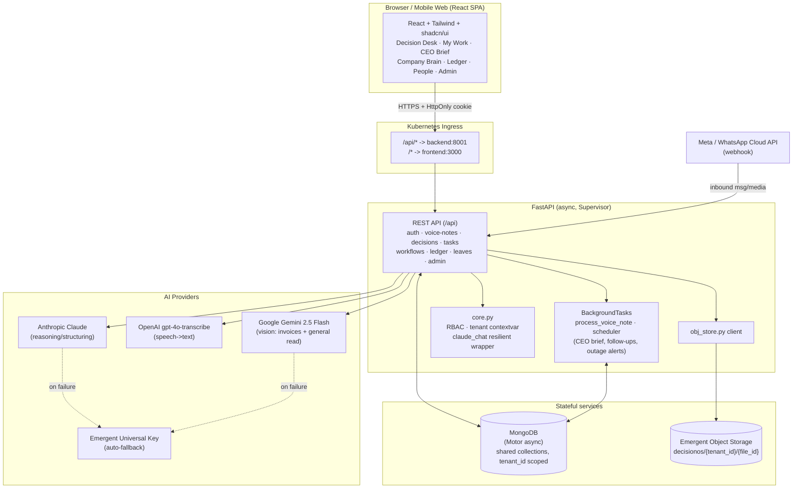
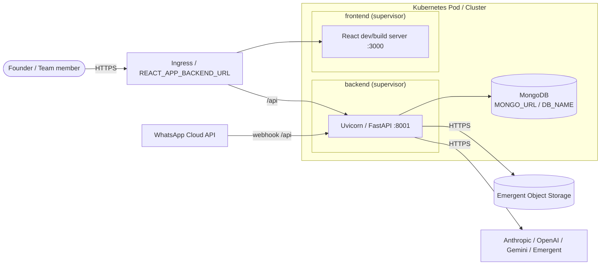
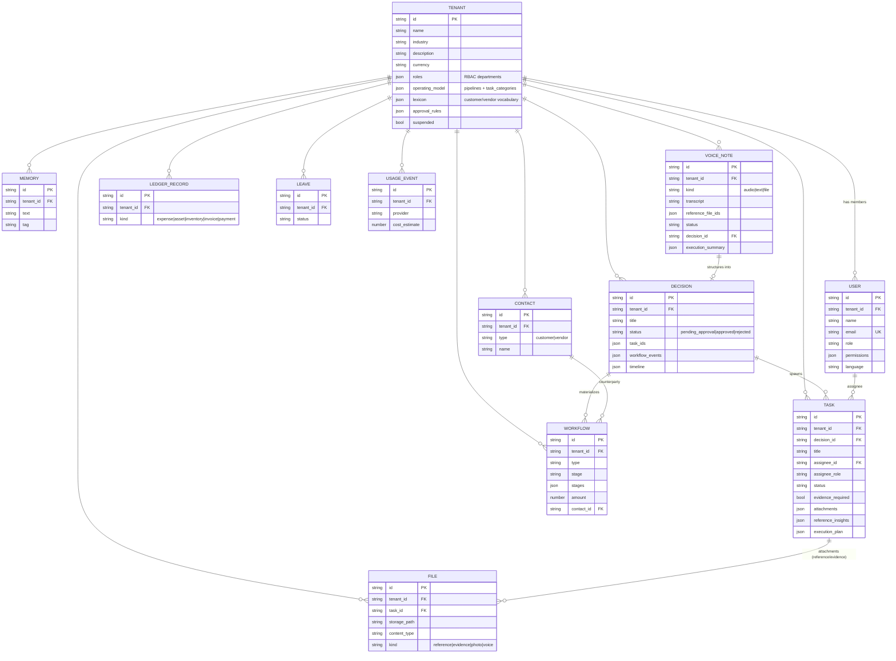
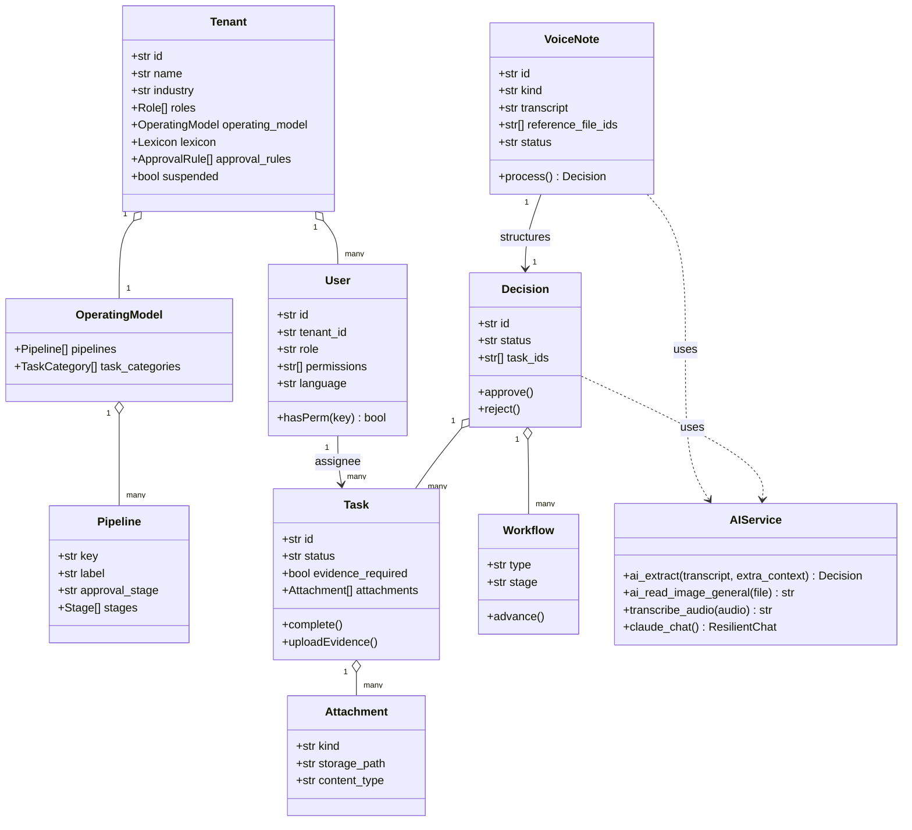
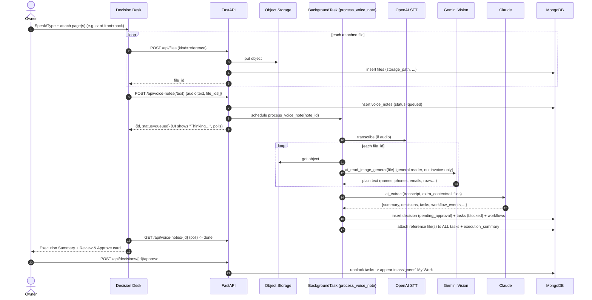
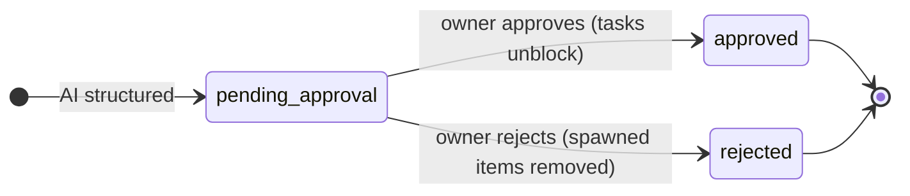
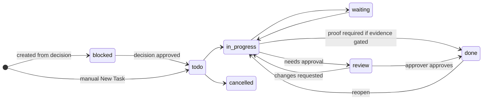
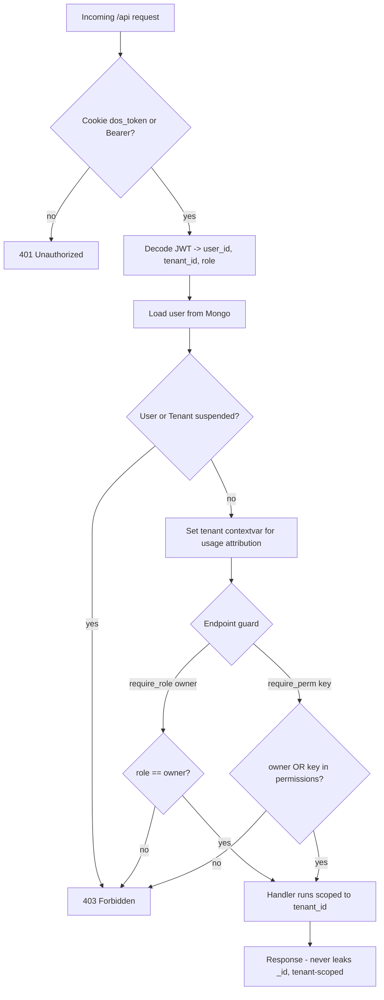

# DecisionOS — UML & Architecture Diagrams

All diagrams are **Mermaid**. They render automatically on GitHub, VS Code (Mermaid ext),
Obsidian, or paste into <https://mermaid.live>. Companion doc: **`SYSTEM_DESIGN.md`**.

Contents:
1. System / Component Architecture (C4‑style)
2. Deployment Diagram
3. Data Model (ER Diagram) — multi‑tenant, shared collections
4. Domain Class Diagram
5. Sequence — Company Provisioning (per‑tenant "schema" creation)
6. Sequence — Multi‑input Capture → Decision → Tasks (with vision + multi‑page)
7. State — Decision & Task lifecycle
8. RBAC / Request authorization flow

---

## 1. System / Component Architecture



---

## 2. Deployment Diagram



---

## 3. Data Model — ER Diagram (row‑level multi‑tenancy)

> No per‑company tables. All entities share collections and are linked by `tenant_id`.
> `TENANT` is the per‑company configuration ("the schema").



---

## 4. Domain Class Diagram



---

## 5. Sequence — Company Provisioning ("per‑tenant schema" creation)

```mermaid
sequenceDiagram
  autonumber
  actor Founder
  participant FE as React (Onboarding)
  participant API as FastAPI
  participant Claude
  participant Mongo as MongoDB

  Founder->>FE: Enter company, industry, description
  FE->>API: POST /api/onboarding/os-blueprint {industry, description}
  API->>Claude: generate departments / workflows / approval rules
  Claude-->>API: OS blueprint (JSON)
  API-->>FE: blueprint (editable)
  Founder->>FE: Curate departments & submit
  FE->>API: POST /api/auth/register {company, blueprint, owner creds}
  API->>Claude: ai_generate_lexicon(industry, roles, desc)
  API->>Claude: ai_generate_operating_model(industry, roles, desc)
  Claude-->>API: lexicon + operating_model
  API->>Mongo: insert tenants {roles, operating_model, lexicon, templates}
  API->>Mongo: insert users {owner, bcrypt hash, role=owner}
  API-->>FE: Set-Cookie dos_token + {tenant, os_summary}
  Note over API,Mongo: No new DB/tables created.<br/>Company config lives in the tenants document;<br/>all future rows carry tenant_id.
```

---

## 6. Sequence — Multi‑input Capture → Decision → Tasks



---

## 7. State Diagrams — Decision & Task lifecycle





---

## 8. RBAC / Request Authorization Flow


