# JOURNEY-1: DecisionOS walked the way our customers use it

*22 September 2026 · branch `karma-redesign` · plan and run log:
[PLAN.md](PLAN.md)*

Our first pilot client found five problems in one day that none of our checks
caught. Those checks look at one screen at a time. This audit walked whole jobs
instead: a new founder's first day, the owner's morning, a task passed between
three people, money going in and out, and the installed phone app on a bad
signal. Everything was saved for real, into throwaway copies of a realistic
company, and every screen was looked at by eye.

## At a glance

| | |
|---|---|
| Journeys walked | **13** (J1–J13). Five desktop journeys were also walked on the phone, and J13 covered the installed phone app. |
| Finished end to end by a real person's route | **9 of 13**. Three were stopped part-way by a missing control: J7 (part payment), J8 (logging a complaint, moving a buyer's stage) and J6 (escalating). J12 ran out of time on one step. |
| Findings filed by the testers | 94 |
| Confirmed after the lead merged duplicates and re-checked them | **3 P0 · 18 P1 bugs · 18 P1 judgment calls · 29 P2** |
| Dropped | 10 test artifacts and 9 already in the bug report, listed at the end |
| Fixed in this pass | **all 3 P0s and 14 of the 18 P1 bugs**, each re-checked on a fresh copy (see *Fixes*). Still open: a PDF decision takes ~6 minutes (for Yokesh), and three layouts that break at 150% text size (see *Fixes*). |

### The ten things a customer would hit first

1. **The Desk and the Finance page disagreed about money owed.** "To collect (overdue)" said ₹6.8L and the Finance page it opens said ₹4L, because each used a different rule for "overdue". *Fixed.*
2. **A complaint could not be logged, and a buyer could not be edited.** No screen could log a complaint or change a buyer after it was added, including their stage or a wrong phone number. *Fixed, desktop and phone.*
3. **Sales and Finance people cannot open CRM until the owner unlocks it.** Priya cannot add a buyer and Sunita cannot add a supplier, and the refusal doesn't say how to get access. *Your call.*
4. **Nobody but the owner can talk to Dex until the owner switches it on,** and the only hint is "Ask an owner to turn on capture". *Your call.*
5. **A new founder on the phone lands on "Sign in", not "Sign up".** An unknown number is told "No account is registered" with no way to make one. *Your call.*
6. **The big "36 / 100" on the Desk has no name, no explanation and doesn't open.** The page that explains it was showing notes written for programmers. *Notes fixed; the dial is your call.*
7. **Amit's and Priya's Desk briefing told them to chase the company's receivables, in dollars.** *Fixed.*
8. **The AI Finance brief said "books appear completely empty" next to a real loss.** Its "Estimated profit" also disagreed with Net profit on the same screen by six times. *Fixed.*
9. **On a slow signal, the phone Desk showed old numbers as if they were live,** and when the keyboard opened, the task update box slid out of view. *Both fixed.*
10. **A decision with a PDF bill attached took almost six minutes.** *Open, for Yokesh.*

---

## The phone app (what customers use most)

Every phone finding says which phone it was:
- **Android 390**: Chromium, 390×844, touch.
- **Android 360**: the same at 360×640.
- **iPhone engine**: WebKit with an iPhone 14 profile.
- **Android slow**: 4× CPU slowdown on a slow 4G line.
- **Big text**: text size at 125% and 150%.
- **iPad**: 820×1180 portrait and 1180×820 landscape.
- **Installed**: standalone mode, with notch and home-bar insets.

**What held up on the phone**
- Things typed are not lost:
  - A task update, a new task and an expense all survived two minutes away, a second tab and a full reload, each with "Kept from before" (J4).
  - A save made offline is refused in plain words, the typing is kept, and it is never saved twice when the signal comes back (J13a).
- **The installed app:**
  - Nothing sits under the notch or the home bar, and every sheet's Save can be reached.
  - The install prompt waits for the third visit, dismissing it sticks, and it never covers the dock.
- **Sunita photographing a bill:** the AI read it right, including the ₹52,002.60 total with GST, and the expense saved with a supplier and a new category, at both 390 and 360 (J7).
- **Dex from the phone's well** built a decision in 7.5 seconds by typing and by voice, with a file attached (J5).
- **Sign-in by mobile number and code:** a number typed with spaces, a wrong code and the right code all behave (J10).

**What didn't, and what happened to it**

| Phone | Finding | Now |
|---|---|---|
| Android 390 | A slow signal showed the Desk's old numbers with no sign they were old (J13a-01) | **Fixed.** "Showing data from 3:37 pm · Refresh" appears whenever the numbers came from the phone's saved copy |
| Android 390 (keyboard) | Opening the keyboard pushed the task-update box off screen (J13a-02) | **Fixed.** The field being typed in is brought back into view, on every form |
| Installed, Android 390 | A new version never said it had arrived (J13a-03) | **Fixed.** "DecisionOS has been updated · Refresh". Nothing reloads by itself, and typing is kept |
| Android 390 (shared phone) | Amit signed out from Settings and his unsent update stayed on the phone. His My Work filters were still there when Priya signed in (J12-04/06) | **Fixed.** Sign-out clears a person's typing and filters first |
| Android 390 | Amit, mid-update, is refused after Rajesh gives the task to someone else. A deleted task gave no message at all (J12-02/03) | **Fixed.** It says what happened, keeps the words and refreshes the task |
| Android 390 | A person the owner removed could still sign in, and got a Desk that never loaded (J12-08) | **Fixed.** At sign-in they read "You're no longer part of Sharma Textiles…" |
| Android 390 | The buyer page on the phone had no way to log a complaint or edit the buyer (J8p-02) | **Fixed** (see P0 below) |
| Android 390 | Amit's briefing told him to chase ₹6.8L of receivables, in dollars (J10-01) | **Fixed** |
| Android 390 | The phone More panel has no way into your own Ops score for anyone but the owner | Already known (GL-02) |
| Android 390 | The empty "Type instead" box on the Desk closes itself after about 2 s (J1-13, J4) | P2, already on Yokesh's backlog |

| Phone | Finding | Now |
|---|---|---|
| **iPhone engine** | Everything after sign-in matched Chromium: the black card, the decision dialog, the Dex well, the dock, More, notifications, Settings, a native date picker, and Amit's whole task loop including a photo. Sign-in itself failed only because this setup serves plain http on localhost, where WebKit drops the secure cookie; production is HTTPS | No difference found |
| **Android slow** (CPU 4×, slow 4G) | A cold open to a usable Desk takes ~22 s. Almost all of it is the sign-in round trip, and the button shows nothing while it waits (J13b-02). No stutter: 0 long tasks opening the black card and More | Your call (a progress state on the sign-in button; look at what sign-in waits for) |
| **Big text 125%** | Finance: two KPI cards' trend chips sit under the dock at rest (you can scroll them clear) (J13b-03) | See *Fixes* |
| **Big text 150%** | The greeting is cut to "Good …"; "Show all 4" prints over the third row of the black card; "Revenue billed" is cut mid-digit ("₹22,85,0…"); More-panel labels are cut ("Appro…", "Workfl…") (J13b-04/05/06) | See *Fixes* |
| **Android 360, Hindi and Tamil** | Desk, My Work, a task, Finance, More and New Task all still fit. No new breaks beyond the known nav-only translation | Worked |
| **iPad** | Portrait (820×1180) gets the phone layout, centred; landscape (1180×820) the desktop layout, and every screen checked works | Worked |
| **Touch** | A sheet's scroll doesn't drag the page; the phone's Back closes the open dialog or drawer, not the page; a double tap doesn't zoom and didn't save twice. The New Task sheet's only close button is 35 px, under the 44 px floor (J13b-07, P2) | Worked |

(How big text was tested: the page's base text size set to 125% and 150%, which is how a phone's text-size setting reaches a web app. It enlarges everything sized in text units, spacing included, so it may overstate some breaks compared with a real phone.)

---

## Each journey

Findings are listed P0 first. Screenshots are in [`shots/`](shots/). The full
set, over 1,500 images, stays in the git-ignored `.audit-artifacts/journey-1/`.

### J1 · First day, on the phone (Suresh, Patil Engineering Works)

**What worked**
- Sign-up by number and code was easy: the code filled itself in, and a one-line interview asked real questions about his shop.
- The build took under a minute, with a progress bar.
- Adding two people (More → Team → Add member) was the easiest part.
- Dex turned "second press brake, ₹18 lakh" into a proper decision in about 10 seconds.
- Money was easy to find, and signing back in by phone worked.

**Where it broke**
- He landed on *Sign in*. His number was "not registered", with no way to register. He only got in through the small "Need a workspace? Register" line.
- After "Looks good — Enter DecisionOS" came a second confirm screen.
- The accountant he added got no access to Money.
- His first bill set off three red "Urgent" AI alarms.
- The approved decision's timeline sent work to `order_intake_&_customer_coordination`.

| id | sev | what | status |
|---|---|---|---|
| J1-08 | P1 bug | A decision's timeline names a team by its internal key (`order_intake_&_customer_coordination`) · 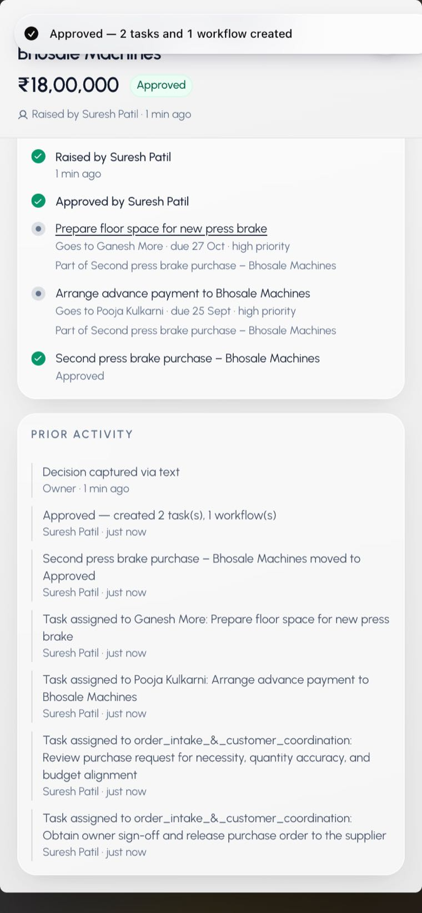 | **Fixed** (`backend:` names the team) |
| J1-01 | P1 judgment | Opens on Sign in; an unknown number is not offered sign-up · 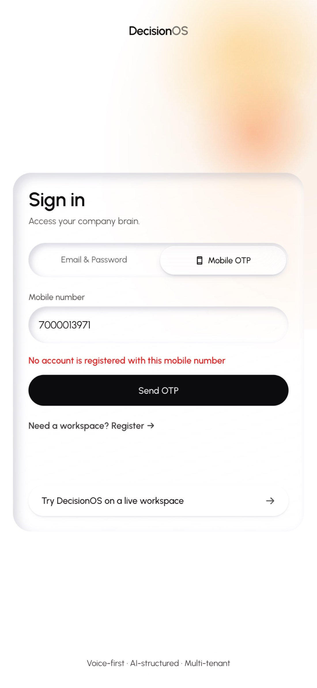 | Your call |
| J1-05 | P1 judgment | An "Accounts & GST" team built by the AI has no Finance access · 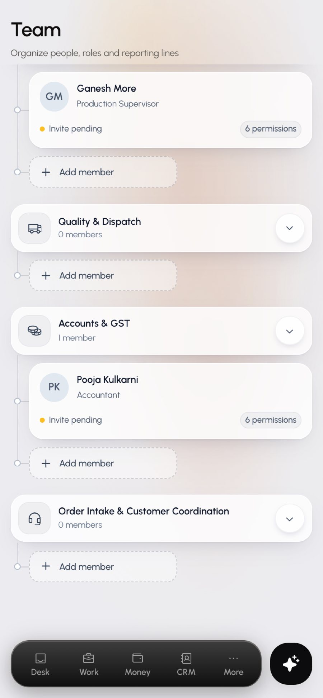 | Your call (on Yokesh's backlog too) |
| J1-10 | P1 judgment | One ₹85,000 bill on day one sets off three red "Urgent" AI alarms · 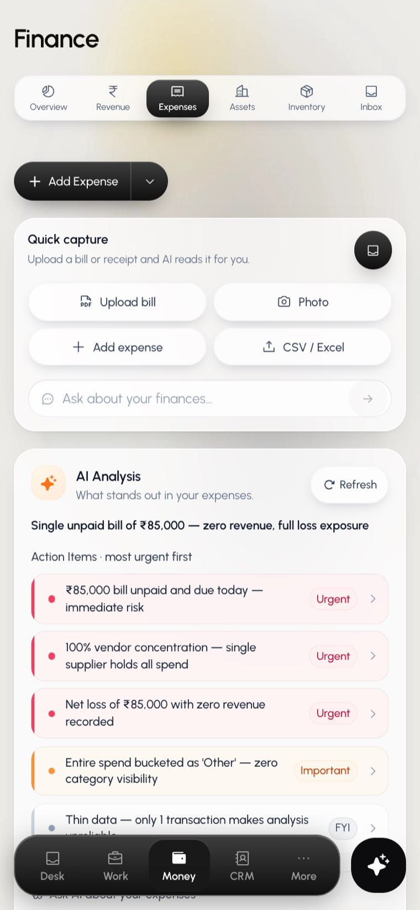 | Your call |
| J1-02 · 03 · 04 · 06 · 07 · 09 · 11 · 12 · 13 | P2 | Native dropdown; jargon; double confirm; "SMS provider" wording; a new task hides under "Asked by me"; "[current period]" left in a preview; an approved purchase leaves no trace in Money; unlabelled dial; the typing box closes itself | Listed below |

The work sent to a team with nobody in it, for a stage the decision only passed through, is already on Yokesh's 0921 "decision needed" list.

### J2 · First day, on a laptop (Lakshmi, Sri Lakshmi Traders)

**What worked**
- Sign-up and the typed interview picked up her own words: "shops", "parties", "groundnut oil".
- She recorded an expense and added her own category on the spot.
- The next session had everything she had saved, apart from one bill she had half typed on the other "device" (expected, since drafts stay on the device).

**Where it broke**
- The mill's name on her bill never became a supplier.
- Buying stock showed as a ₹86,400 loss, and the AI brief beside it said her books were empty.
- The 36/100 score has no name. The page that explains it showed programmers' notes: "not wired", "lands with the backend", "no denominator". *This is where she would have stopped.*
- Changing "Customer" to "Party" took three screens of Settings, and some screens kept the old word.

| id | sev | what | status |
|---|---|---|---|
| J2-09 | P1 bug | The score page shows programmers' notes · 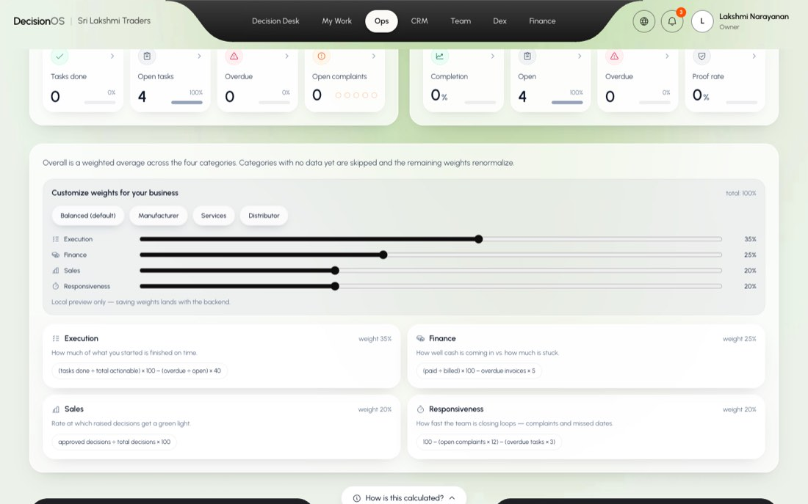 | **Fixed** (plain words) |
| J2-05 | P1 bug | The AI brief says "books completely empty" beside a real loss, into the next day · 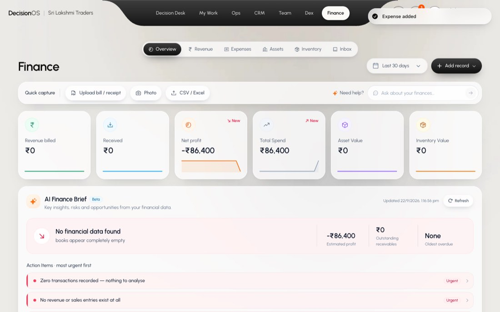 | **Fixed** (says when it was written before your latest entries) |
| J2-04 | P1 judgment | A supplier typed on an expense isn't saved as a supplier, and the supplier's page counts bills only ·  | Your call |
| J2-06 | P1 judgment | Buying stock shows as a loss, in red, on a wholesaler's first day | Your call |
| J2-08 | P1 judgment | The Desk's 36/100 has no name and doesn't open; on day one it says "Needs work" · 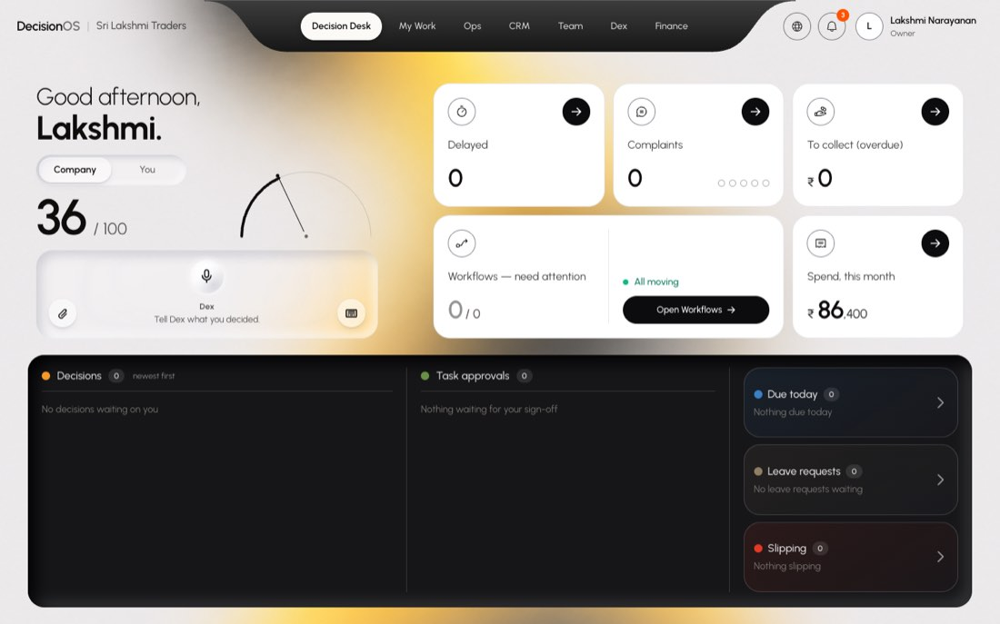 | Your call |
| J2-12 | P1 judgment | Settings says she agreed to send her words to AI providers; no sign-up screen asked | Your call |
| J2-01 · 02 · 03 · 07 · 10 · 11 · 13 · 14 | P2 | Native dropdowns; jargon; the second Enter screen; suppliers under "CRM" start as "Lead"; business words buried; programmer keys in Settings; next-day sign-in opens on Email & Password; bell "3 need you" vs an empty Desk | Listed below |

### J3 · Rajesh's morning, desktop, then phone

**What worked**
- Every number on the Desk matched the API and the page it opens: Decisions, Approvals, Due today, Slipping, Delayed, Complaints, and the score against the score page.
- Approving from a row and rejecting from the popup each moved the counts by exactly one, and both outcomes appeared in the Journal.
- The same was true on the phone at 390 and 360.
- A decision Priya raised reached Rajesh's open Desk in about **25 s without a reload**.

**Where it broke**
- The one tile that didn't match: "To collect (overdue)".

| id | sev | what | status |
|---|---|---|---|
| J3-04 = J7-05 | **P0 bug** | The Desk's "To collect (overdue)" (₹6.8L) and the Finance page it opens (₹4L, "1 invoice") disagree, and the AI panel on that page lists the ₹6.8L · 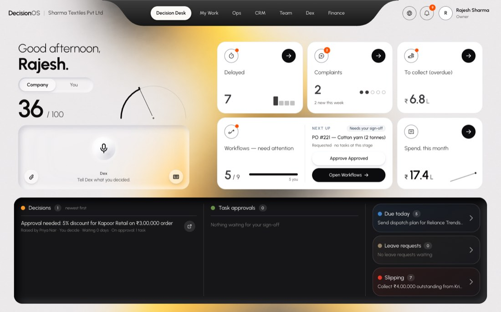 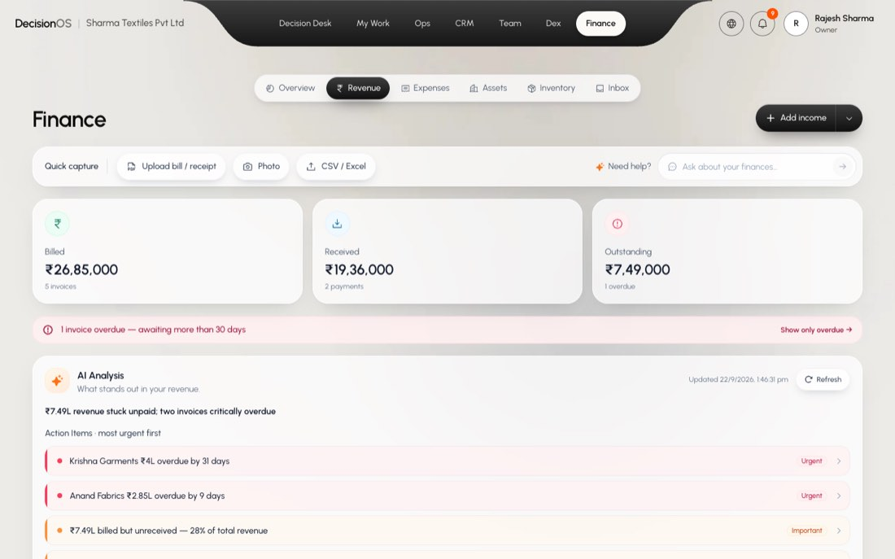 | **Fixed** (one rule, the server's; the page shows days past the due date) |
| J3-01 | P1 judgment | A sales person cannot tell Dex anything until the owner turns capture on · 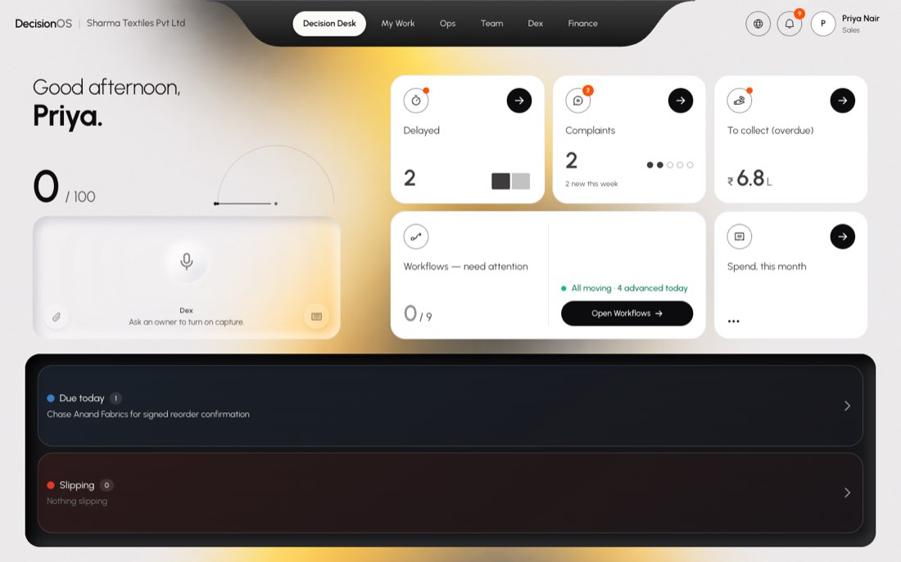 | Your call |
| J3-03 | P2 | Row titles are cut off mid-word | Listed below |

### J4 · Rajesh's morning, phone

**What worked**
- The black card's three tabs matched the API.
- "Show all", every dock and More tile, notifications and Settings (two taps away) all worked.
- Sign-out took four taps. Signing back in by number and code took about 4.5 s.
- **The PILOT-1 typing test passed everywhere.** A real sentence survived two minutes away, a second tab and a reload, on a task update, a new task and an expense. Each said "Kept from before — not sent yet".

**Where it broke:** only small things.

| id | sev | what | status |
|---|---|---|---|
| J4-03 | P2 | The Desk's Dex well keeps an unsent decision but doesn't say so | Listed below |
| (J1-13) | P2 | The empty "Type instead" box closes itself after 1.5–2.5 s (confirmed) | Listed below |

### J5 · Dex, end to end

**What worked**
- "Approve ₹1,20,000 for 400 kg of indigo dye… Amit by next Wednesday, Sunita pays within 15 days" built in 12 s, with the right people and the right dates. Both saw their tasks.
- A visiting card was read correctly.
- A note with nothing to decide was kept as a note.
- With AI switched off, Dex said so plainly and linked to Settings.
- The spoken WAV turned into a correct decision on desktop and phone.
- "What needs my attention today?" got a good answer in 12 s.

**Where it broke**
- A PDF bill took **5 min 46 s** to become a decision.
- The phone dock's Ask couldn't say what customers owe (already known as DX-01).

| id | sev | what | status |
|---|---|---|---|
| J5-01 | P1 bug | A decision with a PDF attached takes ~6 minutes. The Desk gives up waiting after ~90 s and says it will appear later · 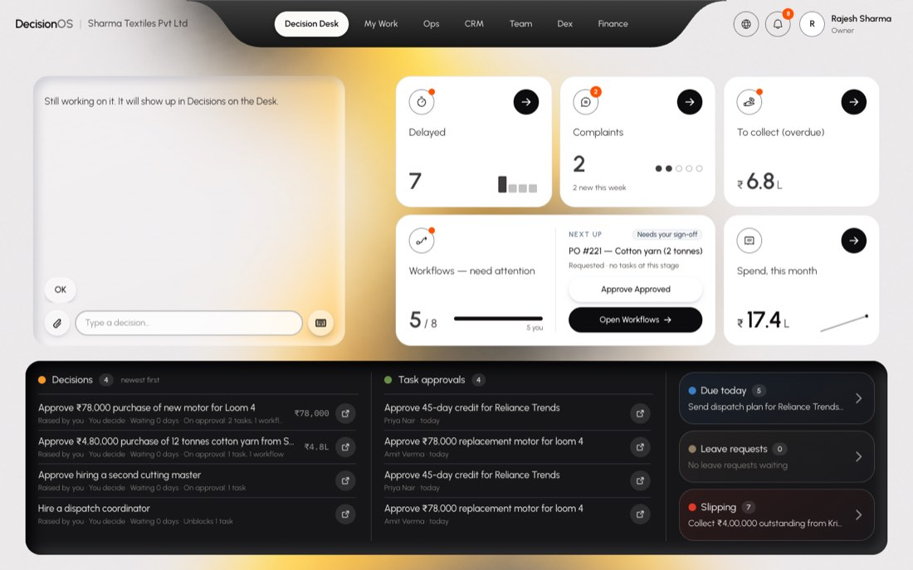 | **Open, for Yokesh.** The server log shows 1 min 41 s inside the Gemini document-OCR call alone, then several model steps. This is model latency, not a screen bug |
| J5-02 | P2 | "Next Wednesday" said on a Tuesday was read as the Wednesday after | Listed below |

### J6 · The task loop (Rajesh, Amit on the phone, an approver)

**What worked**
- A task with a deadline and "approve before start" reached Amit's open phone **without a reload in about 16–21 s**.
- He saw "Awaiting approval — you can start once Rajesh Sharma approves", with no Start button.
- After approval he started it, logged an update, marked it waiting on Sunita, attached a photo as proof and finished it.
- A weekly task made next week's when it was finished.
- A dependent task opened itself when the first one was done.

**Where it broke**
- A hand-off to Priya was refused, rightly, but it left the form open, so escalation was never reached.
- The finished task disappeared from "All statuses".

| id | sev | what | status |
|---|---|---|---|
| J6-01 | P1 bug | My Work's "All statuses" leaves out finished work, for both the owner and the worker · 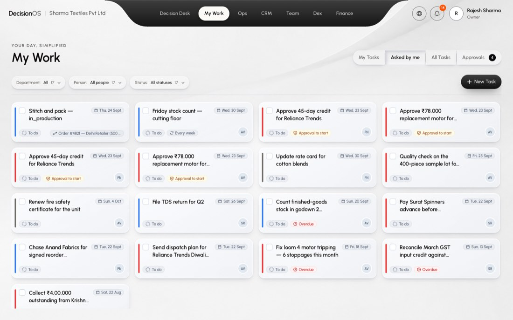 | **Fixed** (the option now reads "All open"; finished work is under "Done") |

### J7 · Money (Sunita, then Rajesh)

**What worked**
- The bill photo was read correctly, with the total including GST, the date and the invoice number.
- She added a new category inside the expense form.
- The same flow worked on the phone at 390 and 360.

**Where it broke**
- Sunita cannot open CRM to add a supplier.
- There is no way to record a part payment against an invoice.
- "To collect" disagreed with the page it opens (the J3 P0).
- Two different "profit" figures sat on one screen.
- A ₹6,00,000 expense went through with no approval: the high-value threshold only applies to WhatsApp captures.

| id | sev | what | status |
|---|---|---|---|
| J7-06 | P1 bug | "Net profit" (last 30 days) and the brief's "Estimated profit" (all time) disagree 6× on one screen, and the second doesn't say it is all time · 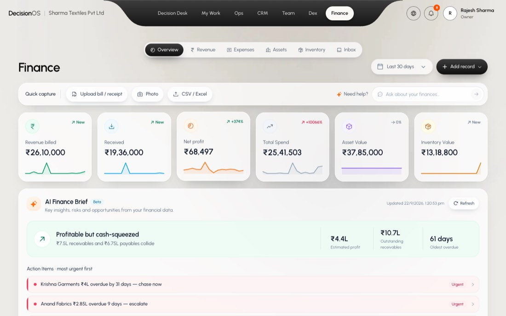 | **Fixed** ("Profit to date") |
| J7-04 | P1 judgment | CRM is closed to Finance (and Sales) by default. The refusal doesn't say who can open it or that Finance's own CSV import can add a supplier · 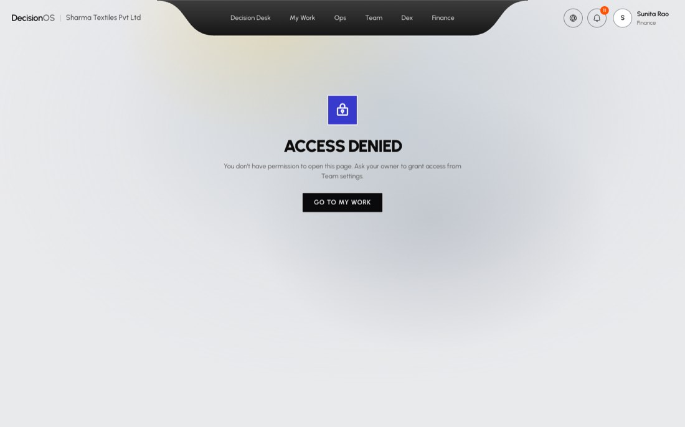 | Your call |
| J7-02 | P1 judgment | No way to record a part payment against an open invoice | Your call |
| (lead) | P1 judgment | The high-value approval threshold in Settings only applies to WhatsApp captures, not to expenses entered by hand | Your call |
| J7-03 · 07 | P2 | A native currency dropdown; the same bill booked as an Expense by one route and an Asset by another | Listed below |

### J8 · Buyers, complaints, workflows, leave (Priya, Rajesh)

**What worked**
- A new workflow with a "Finish by" date showed a clear timeline: "on track — forecast Fri, 2 Oct".
- The new "work left behind" review is well made.
- Leave went end to end: Priya asked, Rajesh approved, and Priya saw the outcome after a reload.

**Where it broke**
- Priya cannot open CRM at all.
- **Rajesh could add a buyer, but nothing on screen could log a complaint or change the buyer afterwards,** including moving them from Lead. The only forms that could lived in a retired page.
- The score took up to 90 s to count a new complaint.

| id | sev | what | status |
|---|---|---|---|
| J8-02 + J8p-02 | **P0 bug** | No way to log a complaint against a buyer, on desktop or phone · 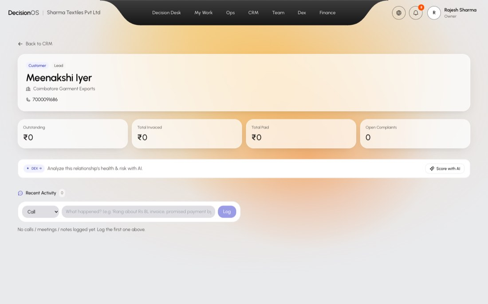 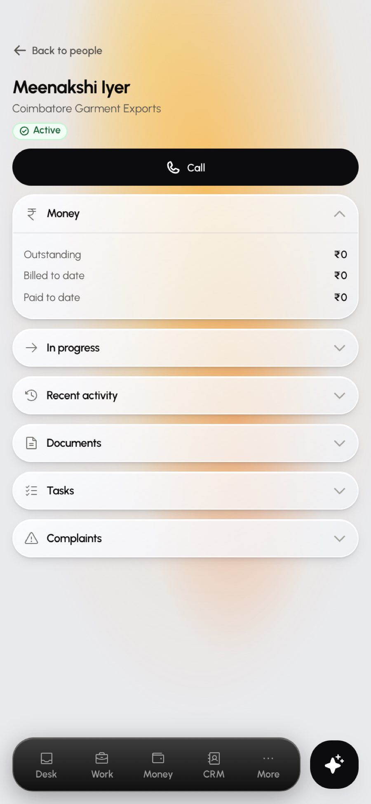 | **Fixed.** "Log complaint" on the buyer's page (desktop and phone), and inside the buyer's Edit window on CRM for people without Finance |
| J8-03 | **P0 bug** | A buyer cannot be edited after it is added, not even the stage · 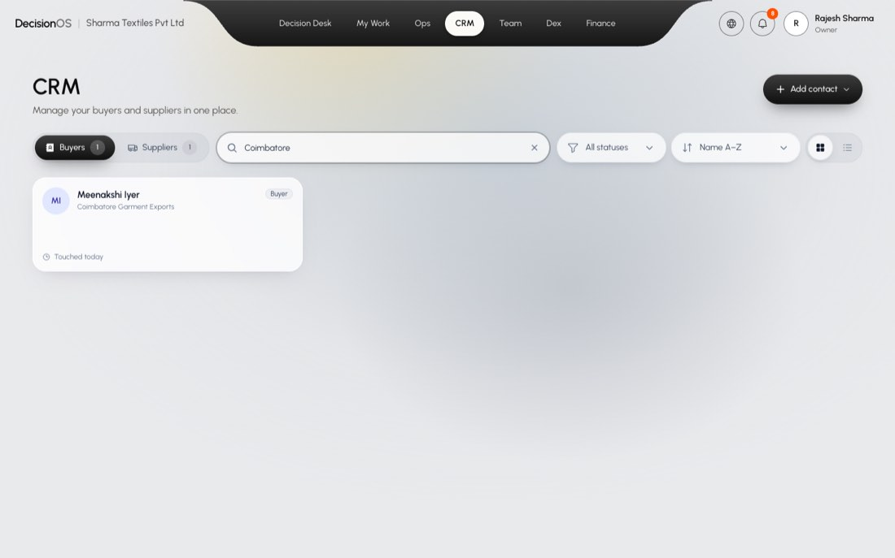 | **Fixed.** "Edit" on the buyer's page (desktop and phone). On CRM, a card opens the Edit window for anyone who manages CRM but can't open the full page |
| J8-05 | P1 bug | Priya's New workflow buyer list is silently empty (the CRM permission) · 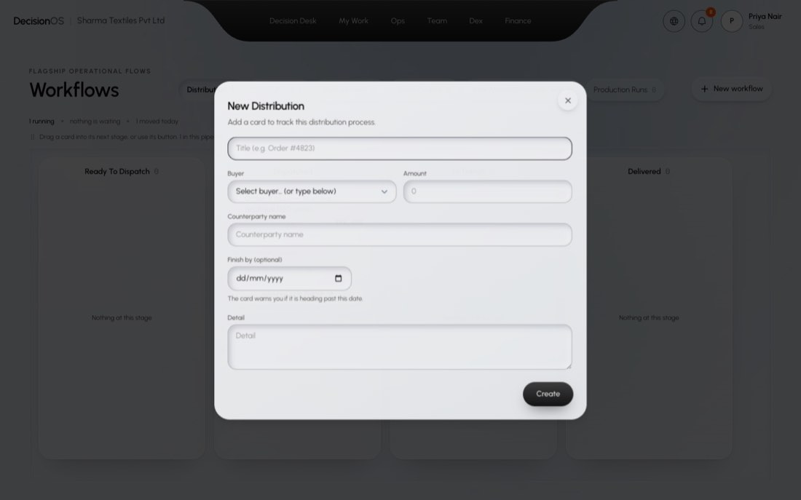 | **Fixed** (says why, and points to the name field) |
| J8-01 / J8p-01 | P1 judgment | Priya (Sales) cannot open CRM, by the 13 Aug permission change (FIX-FUP-51) | Your call (with J7-04) |
| J8-09 | P1 judgment | The Operating Score lags the Desk by up to 90 s after a change (a server cache) | Your call. Already raised in PILOT-1 D |
| J8-06 · 07 · 11 | P2 | Two native dropdowns (leave type, activity kind); the leave outcome needs a reload | Listed below |

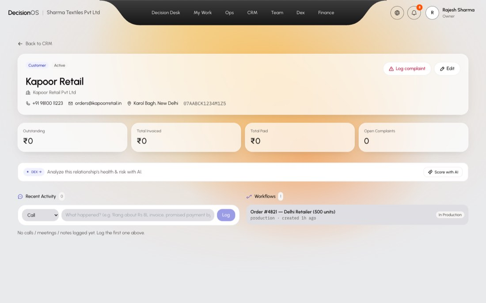
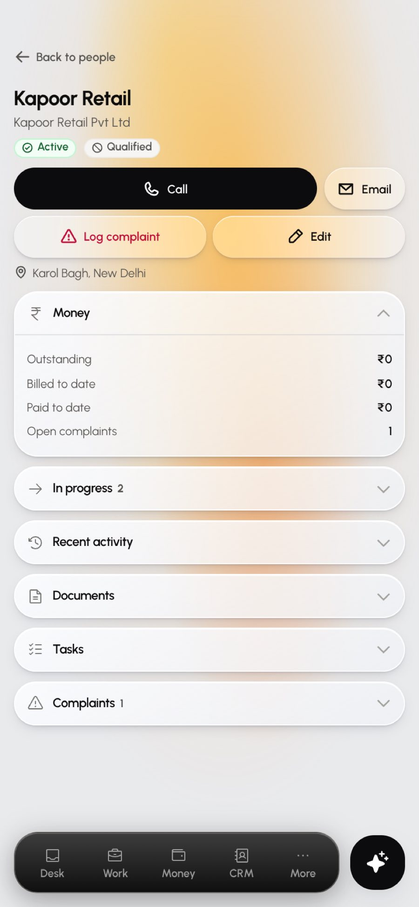

### J9 · Who sees what (four people and an invited fifth)

**What worked**
- The invite link and first sign-in worked.
- **CRM and the owner's Journal are refused for everyone else, with a plain explanation and a way back.**
- Every notification link (14 of them) opened a page that person can see.
- Long names, a 180-character task title, ₹1,00,00,000 and ₹0 all laid out correctly.
- A double-tapped Save made one record, not two.

**Where it broke**
- Hindi and Tamil translate only the navigation.
- Finance still shows in the nav for people who can't use it (already known).
- The Back-button "loss" did not reproduce (see below).

| id | sev | what | status |
|---|---|---|---|
| J9-03 | P1 judgment | Hindi and Tamil translate the nav and titles; buttons, filters and status chips stay English · 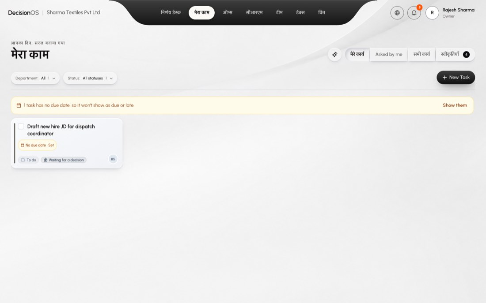 | Your call (a translation pass) |
| J9-02 | P2 (was P0) | Back in the middle of New Task leaves the form without asking. **Re-checked:** the typing is there when New Task is opened again, on desktop and phone, but nothing says it was kept | Listed below |

**Access matrix (desktop)**

| Page | Owner | Sales · Production · Finance · a new invitee |
|---|---|---|
| Desk, My Work, Workflows, Dex, Calendar, Notifications, Settings | opens | opens |
| Finance | opens | the page opens, then every figure is refused (FN-07, known; Finance itself opens it) |
| Team | opens | read-only |
| CRM | opens | refused, explained |
| Journal | opens | refused, explained |
| Operating Score | company view | personal view |

### J10 · A team member's own day (Amit on the phone, Priya on desktop, signed in by mobile and code)

**What worked**
- Sign-in by mobile and code worked (see *Setup* for the seed-data fix it needed).
- "Due today" matched their My Work and the API.
- No decision sat on their Desks.
- A locked task and a refused page both explained themselves.

**Where it broke**
- The top of their Desk is the owner's company figures, re-skinned. Their briefing told them, in dollars, to chase ₹6.8L they can't see.
- Their own score is a bare "0/100". On the phone there is no way to the page that explains it.
- **Verdict:** it leans towards the owner's app with parts hidden. What's personal (their work, their notifications) is right; what's shared was built for the owner.

| id | sev | what | status |
|---|---|---|---|
| J10-01 | P1 bug | A production worker's briefing: "you have $685,000 in overdue receivables…" · 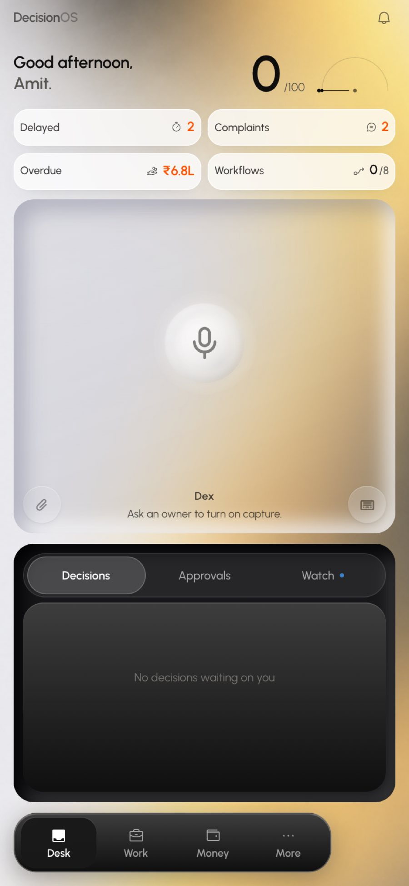 | **Fixed** (`backend:` rupees in lakh and crore; no money for people who can't see money) |
| J10-03 | P1 judgment | Their own score is unexplained and unreachable on the phone (with J2-08; GL-02 known) | Your call |
| J10-04 | P2 | The top row of tiles is company-wide for every role | Listed below |

### J11 · The invited manager (Karthik) and the approval chain

**What worked**
- Karthik's first sign-in from the invite was good: his name and title were carried over, and he was welcomed to the company.
- **Amit's three Dex decisions went to Karthik, not Rajesh.**
- Karthik approved one and rejected one.
- Amit's escalation reached Karthik first.
- Karthik's "My team" shows Amit's work, and Rajesh still sees everything.

**Where it broke**
- "Allowed to approve" is three look-alike checkboxes, and only one of them routes decisions.
- A rejection can't say why.
- Karthik going on leave changes nothing about what is waiting on him. This is recorded only; it's the open question with Yokesh (ASK-5).

| id | sev | what | status |
|---|---|---|---|
| J11-01 | P1 judgment | Three near-identical "approve" permissions; only "Approve Decisions" routes decisions · 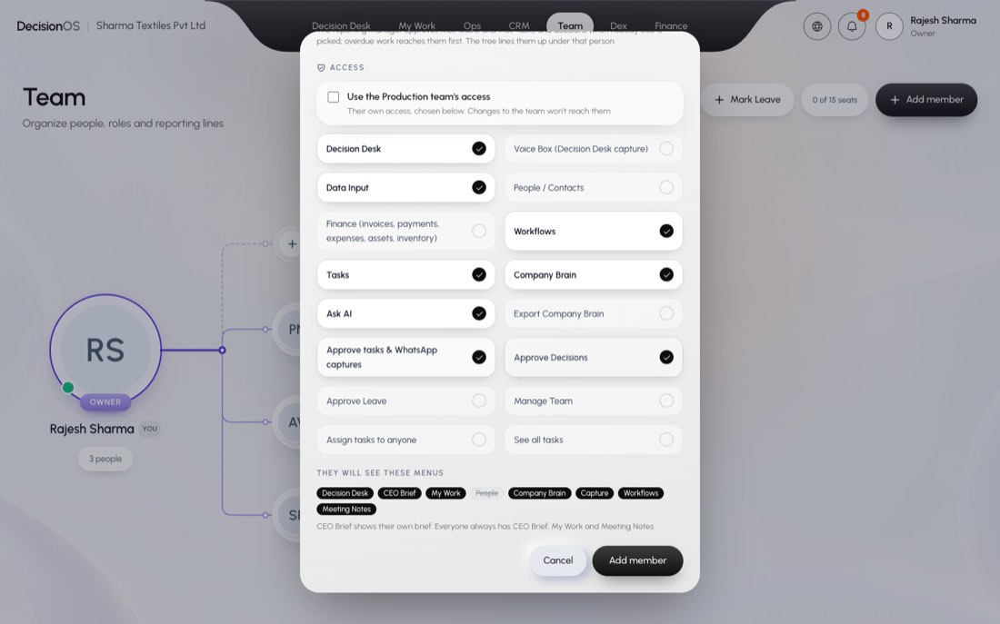 | Your call |
| J11-04 | P1 judgment | Reject has no place for a reason · 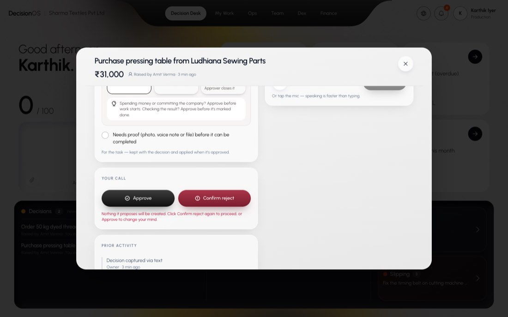 | Your call |
| J11-02 | P1 (recorded) | Leave doesn't move a manager's waiting decisions or escalations | Open question with Yokesh (ASK-5) |

### J12 · Together, and at the same time

**What worked**
- A hand-off refusal names the person and the permission that would allow it.
- "Waiting on Sunita" reached Sunita as a notification that opens the task.
- Nobody lost their words when a task changed underneath them.

**Where it broke**
- The screen didn't say what had changed (a reassigned task, a deleted one).
- A shared phone kept Amit's typing.
- A removed person could sign in to an empty Desk.
- The seat limit counts only people who have signed in.

| id | sev | what | status |
|---|---|---|---|
| J12-02 · 03 | P1 bug | Reassigned or deleted while being typed on: a bare refusal, or nothing at all, and the drawer stays stale · 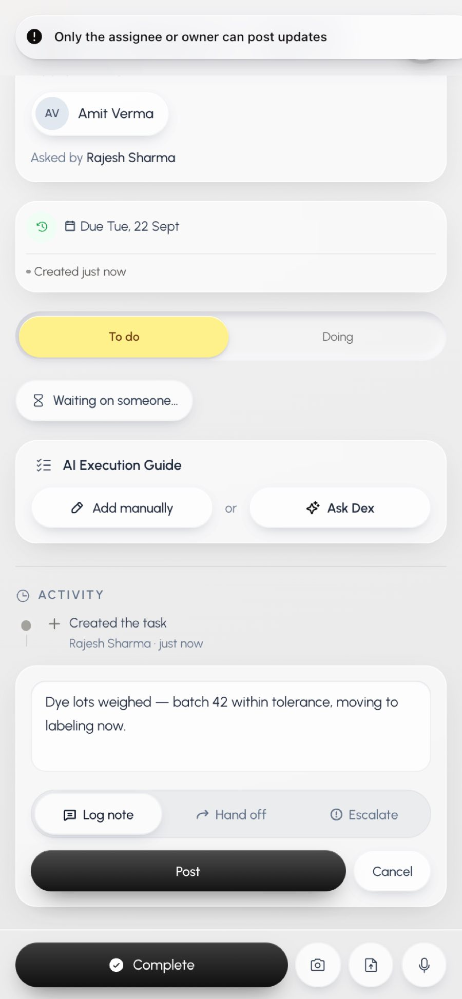 | **Fixed** |
| J12-04 · 06 | P1 bug (was P0) | Signing out from Settings left Amit's unsent words and his My Work filters on the phone. Priya could not see them on screen (they are stored under his id), but they were on the device | **Fixed** (cleared first, before anything else) |
| J12-08 | P1 bug (was P0) | A removed person could sign in. **Re-checked:** every request was then refused, so no data leaked, but they sat on an empty Desk with no reason given · 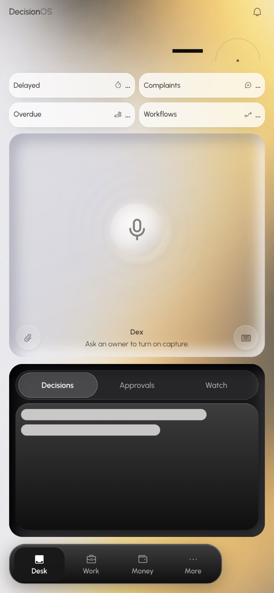 | **Fixed** (`backend:` turned away at sign-in with a sentence) |
| J12-09 | P1 judgment (was P0) | A seat counts only when a person first signs in, so invites are unlimited ("0 of 15 seats" with 23 people invited). The code chose this on purpose, so an invited person is never locked out · 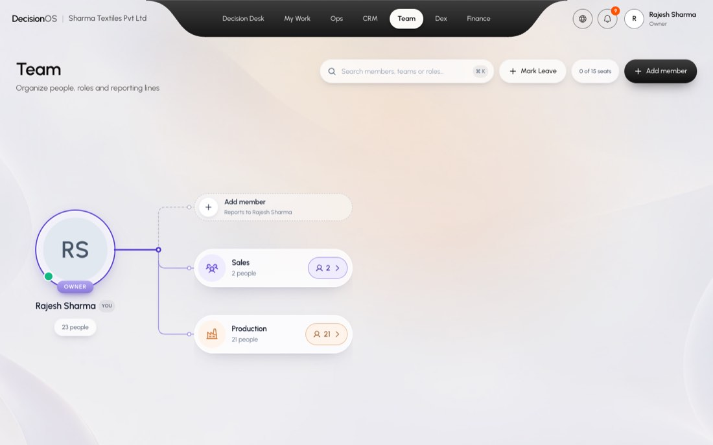 | Your call (with Yokesh's U7-25.24 trial-vs-Starter pricing question) |
| J12-01 · 05 · 07 | P2 | The hand-off picker offers people it will refuse; sign-out and the service-worker cache; the new owner of a removed person's task isn't told | Listed below |

Not covered in J12: two people approving the same item at the same moment. This machine was running too many browsers for the click to land cleanly in the time box.

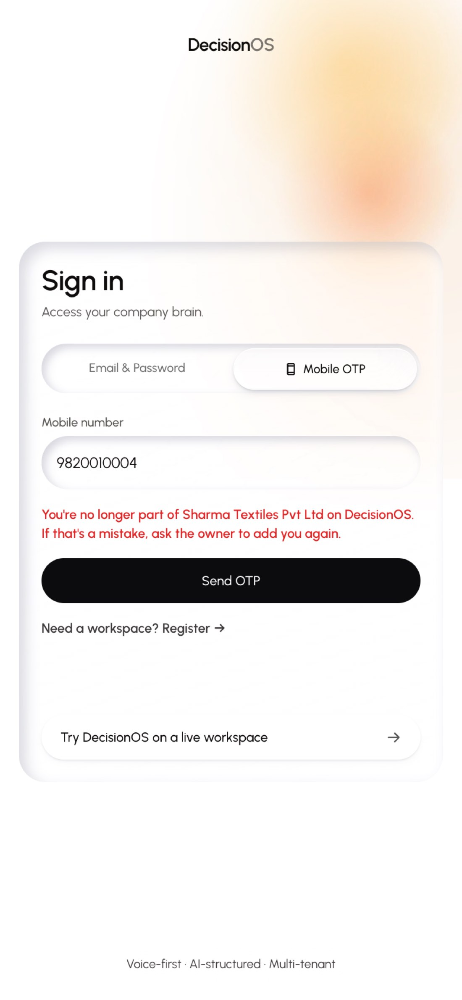

### J13 · The installed app

**What worked (J13a)**
- Standalone mode with a notch and a home bar was clean. The install prompt behaves as promised, and the name, icons and colours are right.
- Offline saves are refused plainly and never duplicated.
- Two minutes in another app lost nothing.
- `verify:pwa` passed 13 of 17, and all four failures trace to one stale sign-in helper in the scripts, not to the app (see *Setup*). `audit:mobile` found the general small-tap and small-text counts it always finds; no new J13 findings.

| id | sev | what | status |
|---|---|---|---|
| J13a-01 | P1 bug | Old numbers on a slow line, with no sign they were old. The app had a StaleStamp built for exactly this and never used it · 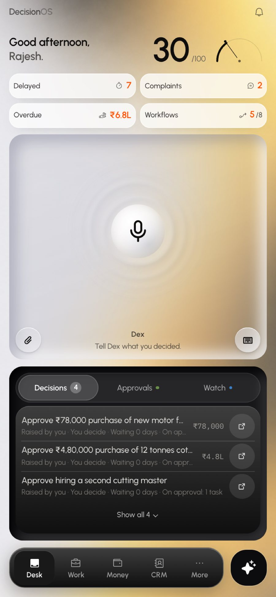 | **Fixed** |
| J13a-02 | P1 bug | The keyboard pushes the task-update field off screen · 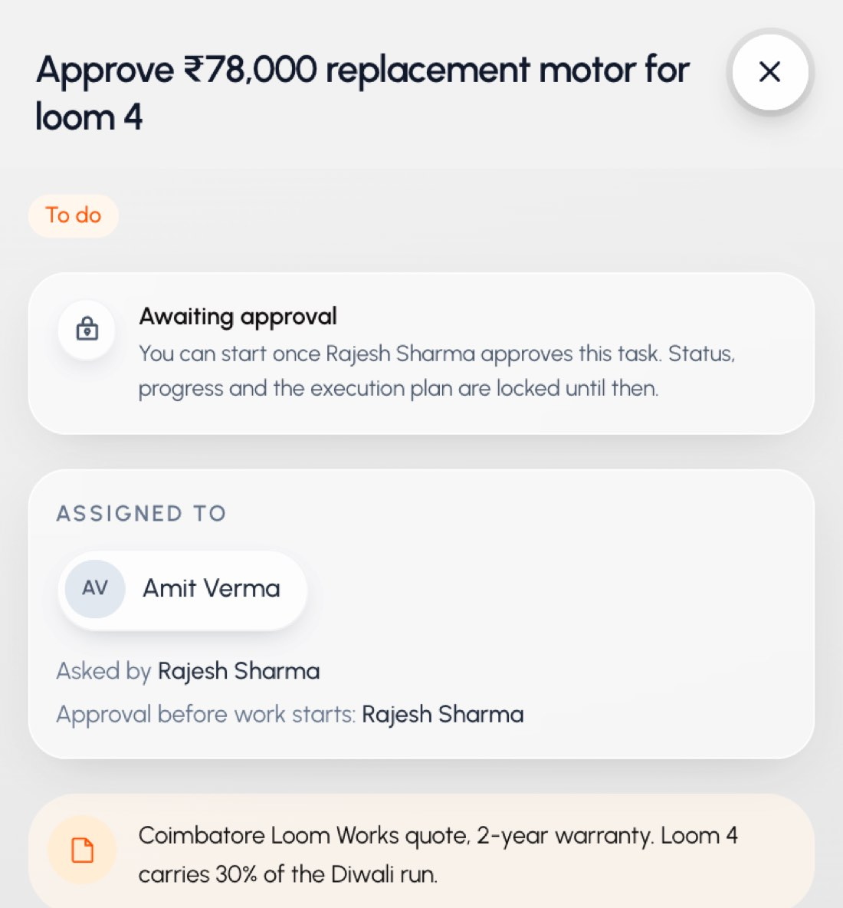 | **Fixed** (every form) |
| J13a-03 | P1 bug | A new version never announces itself | **Fixed** |

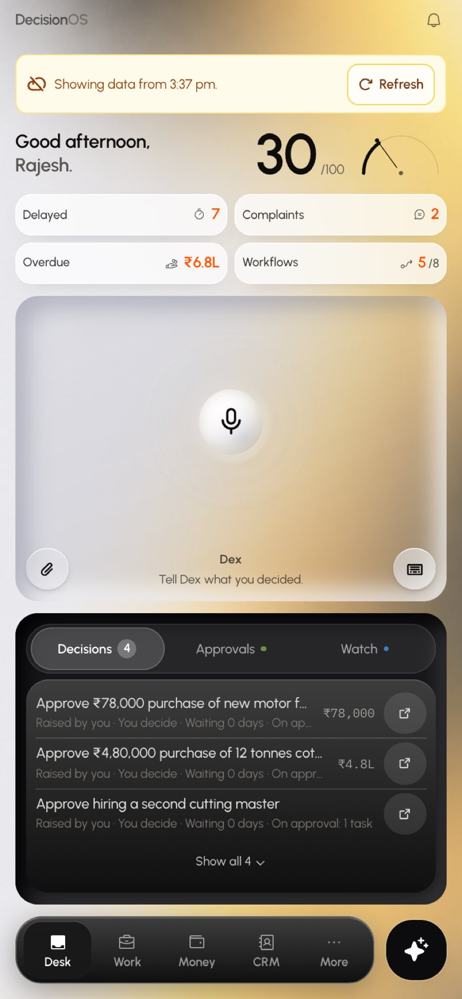

**J13b (the other phones)**, in the phone table at the top. On one line: the iPhone engine and the iPad behave the same as Chromium; slow Android is slow to sign in; bigger text is where the phone layout breaks.

| id | sev | what | status |
|---|---|---|---|
| J13b-04 | P1 bug | At 150% text: the greeting is cut to "Good …" and "Show all 4" prints over a row | See *Fixes* |
| J13b-05 · 03 | P1 bug | At 150% (and partly 125%): "Revenue billed" is cut mid-digit | See *Fixes* |
| J13b-06 | P1 bug | At 150%: More-panel labels are cut ("Appro…") | See *Fixes* |
| J13b-02 | P1 judgment | ~22 s cold sign-in on a slow Android with no progress shown | Your call |
| J13b-07 | P2 | New Task's close button is 35 px, under the 44 px floor | Listed below |

---

## For you to decide (judgment calls, with a recommendation)

| # | The question | Recommendation |
|---|---|---|
| 1 | **CRM for Sales and Finance.** Since 13 Aug (FIX-FUP-51) both need the owner to open CRM, so Priya can't add a buyer and Sunita can't add a supplier (J7-04, J8-01) | Give Sales customers and Finance suppliers by default. At the least, have the refusal name who can open it ("Ask Rajesh: Team → Access → Contacts") |
| 2 | **Dex for non-owners** is off until the owner turns it on (J3-01) | Turn it on by default for every role: decisions still go to an approver. The well should say who to ask, by name |
| 3 | **Sign-in vs sign-up on the phone** (J1-01, J2-13) | Open on "Mobile number". When an unknown number is entered, offer "Start a new company" right there |
| 4 | **The unlabelled score dial** (J1-12, J2-08, J10-03) | Name it ("Operating score"), make it open the score page, and give non-owners a way there on the phone |
| 5 | **Seats count at sign-in, not at invite** (J12-09) | Count invites as seats when they are sent; let an invite that arrives over the limit wait with a clear message. Decide together with trial 15 vs Starter 10 (U7-25.24) |
| 6 | **Part payments** against an open invoice (J7-02) | Add "Record a payment" on an open invoice |
| 7 | **High-value approval** only for WhatsApp captures (J7) | Apply the threshold to every expense, however it is entered |
| 8 | **Stock bought shows as a loss** (J2-06) | Keep stock purchases out of profit, or label the tile "cash spent" |
| 9 | **AI alarms on day one** (J1-10) | No "Urgent" AI alarms until there are, say, 10 records |
| 10 | **Three "approve" permissions** (J11-01) | One "Can approve" switch, with the three kinds underneath for those who want them |
| 11 | **A reason on reject** (J11-04) | An optional "Why?" line, shown to whoever raised it |
| 12 | **Hindi and Tamil coverage** (J9-03) | A translation pass over the Desk, My Work, Finance and Team controls |
| 13 | **AI consent at sign-up** (J2-12) | One line on the build screen: "Dex reads what you type to set up your company" |
| 14 | **A supplier typed on an expense** (J2-04) | Offer "Add to CRM" in the supplier picker; show expenses on a supplier's page |
| 15 | **The score lagging the Desk by ~90 s** (J8-09) | As in PILOT-1 D: clear the score's cache on every write that feeds it |
| 16 | **Leave and a manager's waiting items** (J11-02) | Open question with Yokesh (ASK-5); nothing changed here |
| 17 | **Accounts team with no Finance.** An "Accounts & GST" team the AI builds at sign-up gets no Finance access (J1-05) | Give any team whose name says accounts, finance or billing the Finance permission when the AI builds it |
| 18 | **Slow sign-in on a slow phone** (~22 s, nothing shown) (J13b-02) | Show "Signing you in…" on the button at once, then see what the sign-in round trip waits for |
| 19 | **Automatic brief refresh.** The Finance brief now *says* it is out of date; it could refresh itself instead (one AI call when the books have changed and the page is opened) | Refresh it automatically; the cost is small |

## P2: polish, listed and not fixed

- **Native OS dropdowns,** against the standing rule: sign-up Industry (J1-02, J2-01), Settings currency (J7-03), leave type (J8-06), the CRM activity kind (J8-11).
- **Software words:**
  - Sign-up says "workspace", "B2B/D2C", "OS", "Multi-tenant" and "Traders's" (J1-03, J2-02).
  - Settings shows team slugs and raw keys (J2-11).
  - The decision preview left "[current period]" in (J1-09).
  - The invite sheet mentions an "SMS provider" (J1-06).
- **Flow:**
  - A second confirm screen after "Enter DecisionOS" (J1-04, J2-03).
  - A new task for someone else only shows under "Asked by me" (J1-07).
  - The empty Desk typing box closes itself (J1-13).
  - Back in the middle of New Task gives no warning, though the typing is kept (J9-02).
  - The Dex well doesn't say a draft was kept (J4-03).
  - The leave outcome needs a reload (J8-07).
  - The hand-off picker offers people it will refuse (J12-01).
- **Money:**
  - An approved purchase leaves no trace in Money (J1-11).
  - The same bill is booked as an Expense or an Asset depending on the route (J7-07).
  - Suppliers start as "Lead"; ISO dates in Finance (J2-07).
- **Display:**
  - Cut-off row titles (J3-03).
  - The bell says "3 need you" while the Desk shows nothing waiting (J2-14).
  - Company-wide tiles on everyone's Desk (J10-04).
  - Business words buried in Settings (J2-10).
  - "Next Wednesday" is read as the week after (J5-02).
- **Touch:** New Task's close button is 35 px, under the 44 px floor (J13b-07).
- **Other:**
  - Sign-out doesn't clear the phone's saved screen data, though the service worker does when the logout request passes through it (J12-05).
  - Nobody tells the person who inherits a removed colleague's task (J12-07).

## Not covered, and why

- **J12, two people approving the same item at the same moment.** Three or more browsers on one machine made the click land late. It needs its own run.
- **J6, escalate, rename and reschedule.** The refused hand-off left the form open, and finished tasks were hidden (J6-01, now fixed). Worth a short re-walk.
- **J5, three of the four Dex questions.** The answers arrived (HTTP 200), but the script read the wrong element, so they were not judged.
- **J8, a card old enough to be "stuck".** Every seeded card was made that day. The "stuck" rule needs three working days, which this setup can't fake without changing the clock.
- **Keyboard behaviour on a real device.** Emulation shrinks the screen; a real keyboard also changes the layout, and only a phone shows that.
- **Real SMS, WhatsApp and email.** Switched off on purpose for the whole audit.

## Dropped in the merge

**Test artifacts (9)**
- **J3p-01:** a decision popup "overlapping" the Desk was a screenshot taken 100 ms into its fade-in; at 300 ms it is clean.
- **J11-05:** the phone bell "missing" is a link, not a button, so the scripts looked for the wrong thing.
- **J4-01:** phone sign-in failing was seed data (below).
- **J6-02:** a duplicate task came from the seeder being run twice.
- **J11-03 and J8-10:** retracted by their testers.
- **J7-01:** a duplicate of J7-04.
- **J3-02 and the J6 timing:** measurements, not findings.
- **J4-02:** closed by its own tester.
- **J13b-01:** WebKit couldn't sign in over this setup's plain http; production is HTTPS.

**Already in the bug report (9):** FN-07 (J9-01, J10-02), GL-02 (J9p-01…03), DD-03 (J9-04), CR-13 (J8-04), ASK-5 (J8-08), DX-01 (J5p-01).

## Fixes (one commit each; nothing pushed)

| Commit | Finding(s) |
|---|---|
| Edit a buyer, and log a complaint (desktop, phone, CRM) | J8-02, J8-03, J8p-02 |
| `backend:` one rule for an overdue customer invoice | J3-04 / J7-05 |
| The Finance page shows the server's overdue answer | J3-04 / J7-05 |
| `backend:` a decision's timeline names the team | J1-08 |
| `backend:` the Desk briefing in rupees; no money for people who can't see it | J10-01 |
| `backend:` a removed person is told at sign-in | J12-08 |
| The score page in plain words | J2-09 |
| My Work's first option says "All open" | J6-01 |
| The Finance brief: "Profit to date", and says when it's out of date | J7-06, J2-05 |
| The New workflow buyer list says why it's empty | J8-05 |
| The task drawer after a reassignment or a delete | J12-02, J12-03 |
| Sign-out clears a person's typing and filters first | J12-04, J12-06 |
| The Desk says when its numbers are the phone's saved copy | J13a-01 |
| The field being typed in stays in view when the keyboard opens | J13a-02 |
| "DecisionOS has been updated · Refresh" | J13a-03 |

**Re-walked after fixing**, on a fresh world serving a new production build:
- the buyer fix as Rajesh (desktop and phone) and as Priya with CRM access but no Finance;
- the overdue rule: the Desk ₹6,85,000 equals the page's 2 invoices, ₹6,85,000;
- the score words, "All open", "Profit to date" and the out-of-date note;
- Amit's briefing (no money) and Rajesh's ("₹6.85 lakh");
- shared-phone sign-out (2 keys before, 0 after);
- reassigned while typing (says why, keeps the words);
- the keyboard (the field stays in view in a 420 px screen);
- the Desk on a server answering 6 s late ("Showing data from 3:37 pm · Refresh");
- a removed person told at sign-in.

All passed. The backend fixes have `with_test_db` tests (new: `test_journey1_*`), and the existing sign-in, invite, Desk-narrative and Desk-latency tests pass. Two existing tests were updated, with notes: a suspended member is now refused at the code step, and the Desk summary makes one more read, in the same parallel batch.

## Setup, and where it differed from the brief

- **Database.** A throwaway MongoDB ran in a local container, never Atlas and never `founder-os-58`. `backend/.env` was not edited: every audit process got its settings from its own environment, with every messaging key blanked. New people used 7000xxxxxx numbers and example.com addresses.
- **Worlds.** Instead of "a company per saving journey", each saving journey got its **own full copy of the seeded company**: its own database, backend and frontend port. So a count finding could only come from that journey's own saves.
- **Smoke test.** Yokesh's scripted three-person scenario (`ux_engine_multiuser_0921.py`) passed:
  - sign-up, the typed interview and the build;
  - two invites and invite sign-in.

  Then the harness itself crashed, because the Python Playwright didn't match the borrowed browser. The rest is covered by J3, J5 and J6.
- **Seed data.**
  - The demo company's four people had no normalised phone number, so none of them could sign in by mobile and code. This was fixed in every copy; people added through Team were never affected. It is worth fixing in `bootstrap/seed.py` so demos can sign in by phone.
  - Running the demo seeder twice duplicated two tasks and a complaint.
- **Testers.** The two definitions are in `.claude/agents/`, but a session only loads agent types when it starts. So the testers ran as general-purpose agents on the same models, each reading its definition first. The effort level could not be set this way.
- **Test tooling to fix** (not product): `frontend/scripts/lib/auth.mjs` and `audit-mobile.mjs` don't open the login screen's demo panel before looking for the demo seats, so `verify:pwa` and `audit:mobile` fail at sign-in until that one line is added.
